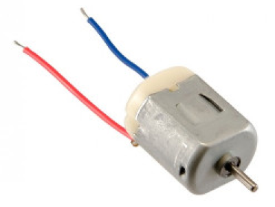

# BDC Motor SCAD

An OpenSCAD library for modeling brushed DC motors with customizable parameters.

## Features

- Optionally generates the axle as a separate part, isolated by a tiny sleeve hollow.
- Optionally generates masking-out blocks for wiring, useful if subtracting this model from another design.

## Testing

Examples of the "130 Size" 6V motor with a 29mm long body that the original author used for reference and testing:

- [Adafruit - DC Toy / Hobby Motor - 130 Size](https://www.adafruit.com/product/711)
- [Core Electronics - Brushed DC Motor - 130-Size](https://core-electronics.com.au/brushed-dc-motor-130-size-6v-11-5krpm-800ma-stall.html)

## License

BSD License (unchanged from the initial release by the original author). See [LICENSE](./LICENSE) for details.

## Acknowledgement

Originally shared on [Thingiverse](https://www.thingiverse.com/thing:3932497) by Craig Ringer <ringerc@ringerc.id.au> (Copyright 2019).

Forked from: [https://github.com/ringerc/openscad-hobby-dc-motor](https://github.com/ringerc/openscad-hobby-dc-motor). The fork connection was severed as it has diverged significantly from the original.

The image of a 130-size 6V DC motor is from [core-electronics.com.au](https://core-electronics.com.au/).
